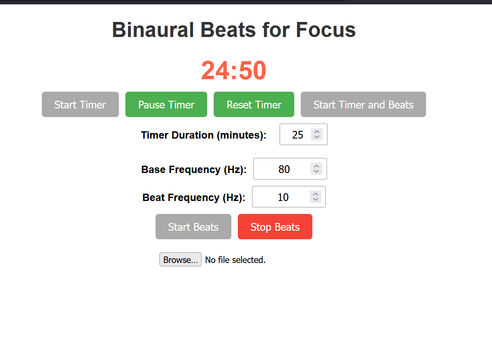

# Binaural Beats for Focus



This is a React application that generates binaural beats and includes a customizable timer for focus sessions.

## Getting Started

These instructions will help you set up and run the project on your local machine.

### Prerequisites

- Node.js (version 12 or higher)
- npm (usually comes with Node.js)

### Installation

1. Clone the repository or download the source code.
2. Open a terminal and navigate to the project directory.
3. Install the dependencies by running:


## build

```bash

sh deploy.sh
```

which will build the app and copy the build folder to the docs folder. Since github pages is configured to serve the docs folder, this will deploy the app to the web. Wierd. lol. 


